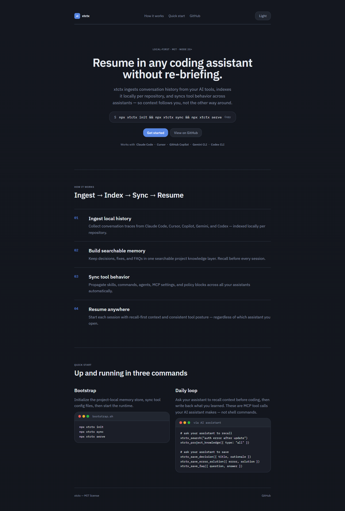
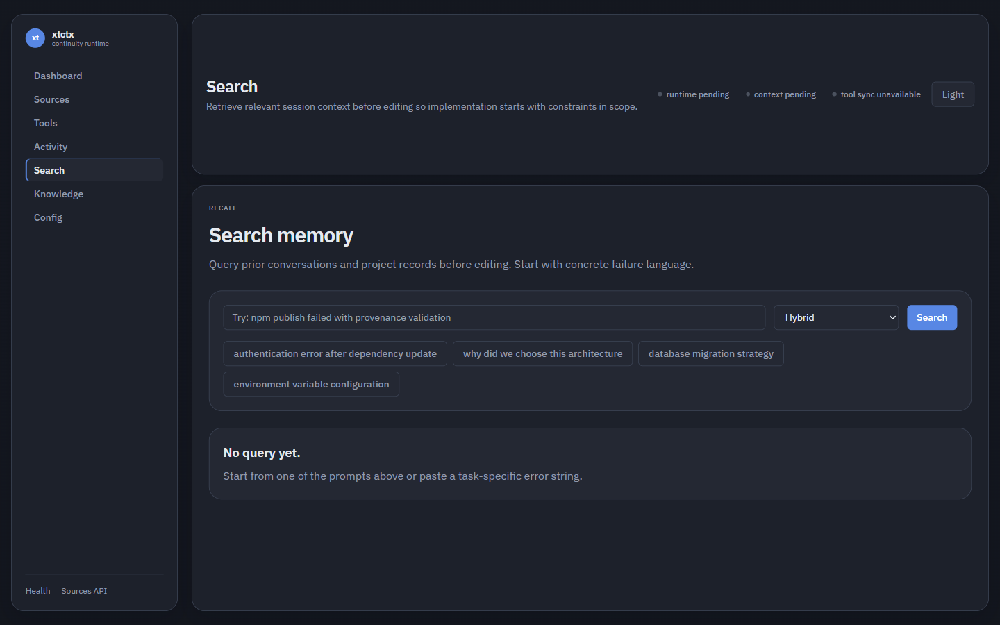

# xtctx

[](https://github.com/fstubner/xtctx/actions/workflows/ci.yml)
[](https://github.com/fstubner/xtctx/actions/workflows/deploy-landing.yml)
[](https://github.com/fstubner/xtctx/actions/workflows/release-please.yml)
[](https://github.com/fstubner/xtctx/actions/workflows/publish.yml)
[](https://github.com/fstubner/xtctx/releases)
[](LICENSE)
[](https://nodejs.org/)

xtctx is a **cross-tool continuity orchestrator** for AI coding workflows.

It keeps project context portable across assistants by:

1. ingesting local conversation history and project memory;
2. indexing it for recall (`xtctx_search`, `xtctx_project_knowledge`);
3. syncing shared tool behavior (skills, commands, agents, MCP/slash config, whitelist policy);
4. letting you resume in any tool without re-briefing.



## Core Workflow

```text
Init -> Sync -> Serve -> Recall -> Writeback
```

1. `xtctx init` scaffolds `.xtctx/` (config, policy, memory folders).
2. `xtctx sync` renders managed continuity blocks into tool-native targets.
3. `xtctx serve` runs MCP + API + runtime web UI, and auto-reconciles sync drift.
4. At session start, call recall tools first.
5. After validated implementation, write outcomes back for the next handoff.

## Quick Start

```bash
npm ci
npm --prefix web ci
npm --prefix landing ci
npm run build

npx xtctx init
npx xtctx sync
npx xtctx serve
```

Open:

- Runtime UI: `http://127.0.0.1:3232/`
- Health: `http://127.0.0.1:3232/health`
- API: `http://127.0.0.1:3232/api/*`

Optional full re-index:

```bash
npx xtctx ingest --full
```

## Practical Cross-Tool Session Pattern

These are **MCP tool calls** your AI assistant makes — not shell commands. Ask your assistant to run them, or configure `SessionStart` hooks to inject context automatically (generated by `xtctx sync` for Claude Code).

**Before coding** — ask your assistant to recall:
```
xtctx_search("auth error after last deploy")
xtctx_project_knowledge({ type: "all" })
```

**After coding** — ask your assistant to save what you learned:
```
xtctx_save_decision({ title, rationale, alternatives_considered })
xtctx_save_error_solution({ error, solution, context })
xtctx_save_faq({ question, answer })
```

This is the handoff loop that keeps context continuity stable across assistant boundaries.



## Continuity Policy Model

Repo policy lives in:

```text
.xtctx/tool-config/shared.yaml
```

Optional global baseline:

```text
~/.xtctx/global-policy.yaml
```

Merge order:

1. global baseline
2. repo policy
3. runtime overrides (future)

Per-tool controls:

- scope: `project` | `global` | `hybrid`
- categories: Core 7
  - `context_feed`
  - `skills`
  - `commands`
  - `agents`
  - `mcp_servers`
  - `slash_commands`
  - `whitelist_policy`

## Sync + Status Surfaces

### CLI

- `xtctx sync`: manual reconciliation
- `xtctx serve`: startup sync + periodic drift reconciliation

### API

- `GET /api/continuity/effective-policy`
- `GET /api/continuity/tools-status`
- `POST /api/continuity/sync`
- `POST /api/continuity/sync/:tool`
- `PUT /api/continuity/tools/:tool`
- `GET /api/continuity/warnings`

### MCP tools

- `xtctx_continuity_status`
- `xtctx_effective_policy`
- Existing recall/writeback/config tools remain available.

## Knowledge Types

xtctx stores structured records in `.xtctx/knowledge/*`:

- `decision`
- `error_solution`
- `insight`
- `convention`
- `gotcha`
- `faq`

## Config Philosophy

- Primary source: `.xtctx/config.yaml` and `.xtctx/tool-config/shared.yaml`
- Environment variables are override-only for explicit temporary use

Security overrides:

- `XTCTX_API_TOKEN`
- `XTCTX_ALLOWED_ORIGINS`
- `XTCTX_ALLOW_LOCALHOST_ORIGINS`
- `XTCTX_RATE_LIMIT_WINDOW_MS`
- `XTCTX_RATE_LIMIT_MAX`

## Search

`xtctx_search` and the Web UI search bar both use the same **LanceDB hybrid
search pipeline** (vector + full-text, Reciprocal Rank Fusion):

- `hybrid` (default) — fuses semantic and keyword rankings
- `semantic` — embedding vector similarity only
- `keyword` — full-text search (FTS) only

The first search in a new server process may be slower as the embedding model
is loaded lazily on first use.

### Session cache

The runtime holds a short-lived in-memory index of conversation sessions for
`xtctx_recent_sessions`. The cache is refreshed:

1. **Automatically** — entries expire after 60 seconds (configurable).
2. **On write** — any ingestion cycle that produces new data immediately
   invalidates the cache, so the next read reflects the new messages without
   waiting for the TTL.

## Project Layout

- `src/`: CLI, API, MCP, ingestion, storage, sync engine
- `web/`: runtime operations console served by `xtctx serve`
- `landing/`: public site deployed via GitHub Pages
- `tests/`: unit/integration/security suites

## Development + Release

```bash
npm run verify:release
```

Release automation:

- Conventional commits -> Release Please release PR
- Merge release PR on `main` -> GitHub Release
- Published GitHub release -> npm publish (OIDC trusted publishing)

See `CONTRIBUTING.md` and `SECURITY.md` for contributor and security policy details.
